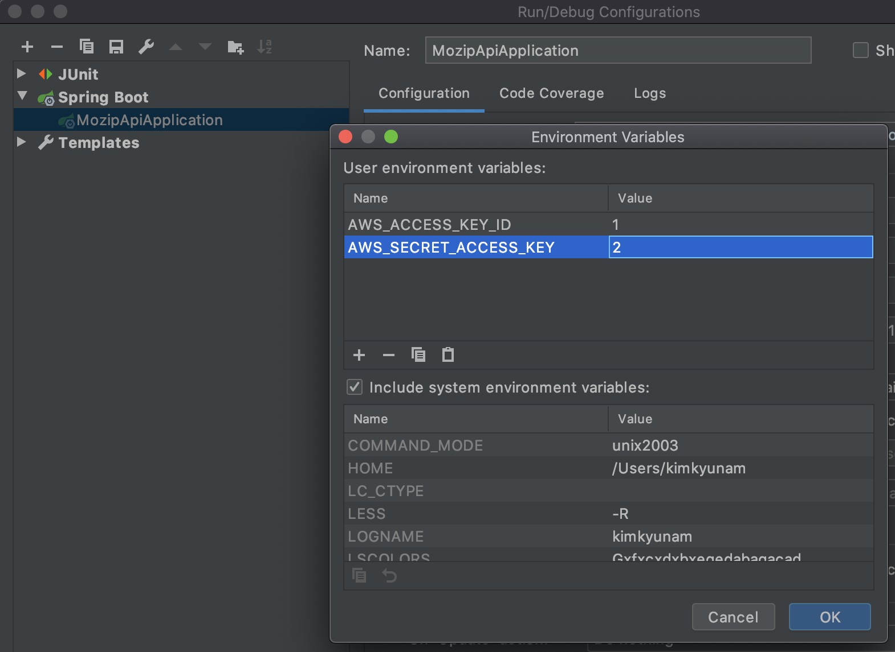

# 모집모집 서버

## :whale: Local environment setup guides

- **MySQL container**

`local` profile에서 MySQL을 사용하기 때문에 Spring Boot 어플리케이션 실행 전 루트에서 아래 명령어를 실행한다.

```bash
$ docker-compose up -d
```

- **Set environment variables**

S3 업로드를 위해 aws sdk v2를 사용
 
 EnvironmentVariableCredentialsProvider를 사용하기 때문에 아래와 같은 환경 변수를 설정해야 한다.



```bash
AWS_ACCESS_KEY_ID = DM으로 물어보세요
AWS_SECRET_ACCESS_KEY = DM으로 물어보세요
```

- **Local setup**

```bash
$ ./gradlew :mozip-server:mozip-api:build
$ cd mozip-server/mozip-api
$ docker build -t mozipmozip .
$ docker run -p 8080:8080 -d mozipmozip:latest
```
